# Alternating RandONets

Alternating RandONets is an efficient operator learning framework based on random projection and alternating optimization.  
Instead of training all network parameters using gradient descent, the framework randomly initializes hidden-layer weights and computes output-layer weights analytically through closed-form least-squares updates. This design significantly improves training efficiency while retaining strong approximation capability.

This repository contains several implementations and experiments of Alternating RandONets for benchmark operator learning tasks, including supervised and physics-informed settings.

---

## Highlights

- Fast training through analytical output-weight updates
- Alternating optimization for branch and trunk output layers
- Random projection based architecture with low computational overhead
- Compact parameterization with strong predictive performance
- Support for both supervised and physics-informed learning
- Built-in visualization and MATLAB export utilities

---

## Method Overview

Alternating RandONets builds on the idea of random projection and introduces an alternating optimization strategy:

1. Hidden-layer parameters are randomly initialized and fixed.
2. The output weights associated with the branch network are updated by solving a regularized least-squares problem.
3. The output weights associated with the trunk network are then updated in closed form.
4. These two steps are alternated during training.

Compared with conventional fully gradient-based operator learning methods, this framework greatly reduces training cost and improves efficiency.

---

## Framework

<p align="center">
  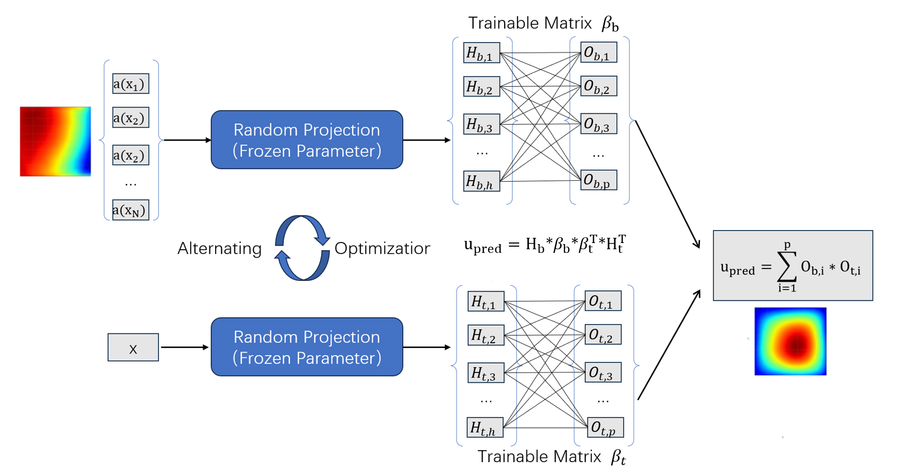
</p>

<p align="center">
  Overview of the Alternating RandONets framework.
</p>

---

## Repository Structure

```text
.
├── LICENSE
├── README.md
├── mainstruction.png
├── heatgit.png
├── heatgit1.png
├── burgersgit.png
├── burgersgit1.png
├── rdgit.png
├── rdgit1.png
├── poissongit.png
├── poissongit1.png
├── 3dpoisson.png
├── 3dpoisson1.png
├── burgerstest.py
├── heattest.py
├── pi-possiontest.py
├── poisson5d.py
├── possiontest.py
└── rdtest.py
```

---

## Requirements

The code was tested with the following environment:

- Python 3.9+
- PyTorch 2.0+
- NumPy
- SciPy
- Matplotlib

Install the required packages with:

```bash
pip install torch numpy scipy matplotlib
```

---

## Quick Start

Run any experiment script directly. For example:

```bash
python possiontest.py
```

Other available scripts include:

```bash
python pi-possiontest.py
python poisson5d.py
python heattest.py
python burgerstest.py
python rdtest.py
```

---

## File Description

- `possiontest.py` - standard Alternating RandONets experiment
- `pi-possiontest.py` - physics-informed Alternating RandONets experiment
- `poisson5d.py` - higher-dimensional experiment
- `heattest.py` - additional benchmark test
- `burgerstest.py` - additional benchmark test
- `rdtest.py` - additional benchmark test

---

## Results

### Example 1

<p align="center">
  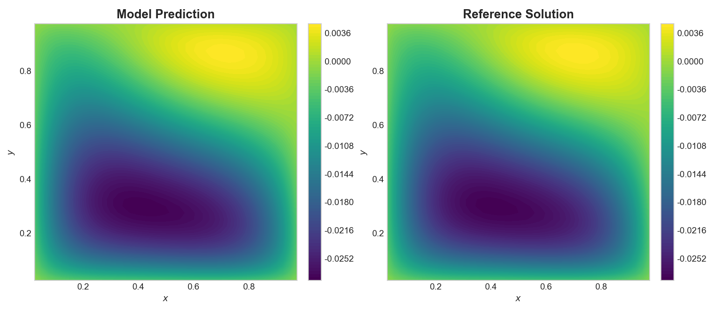
  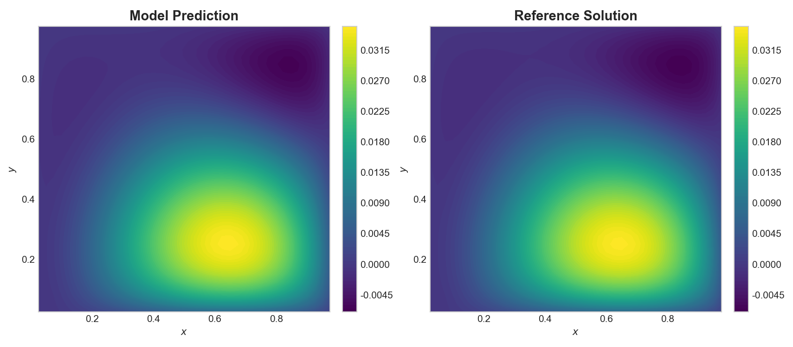
</p>

### Example 2

<p align="center">
  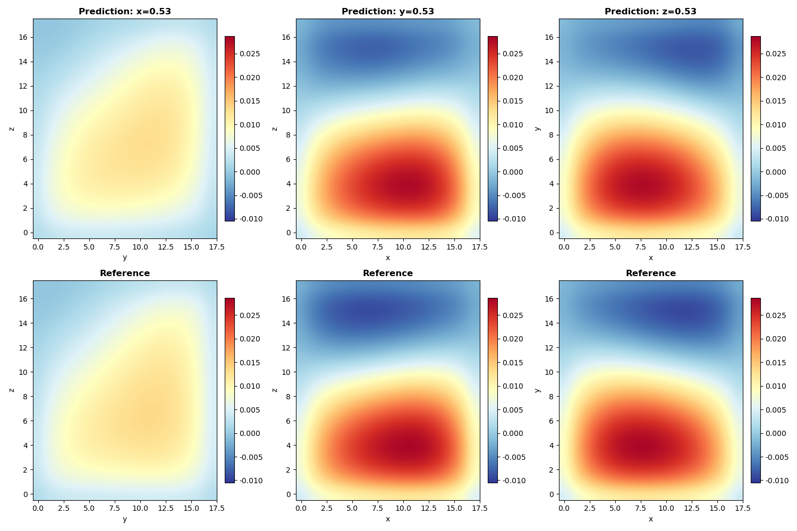
  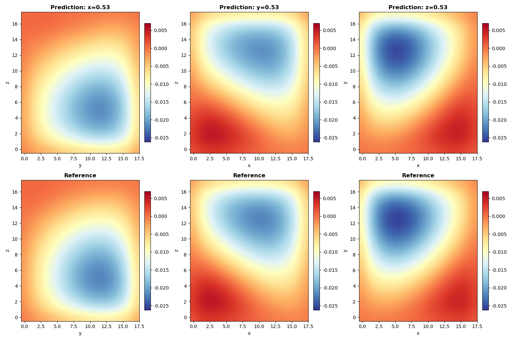
</p>

### Example 3

<p align="center">
  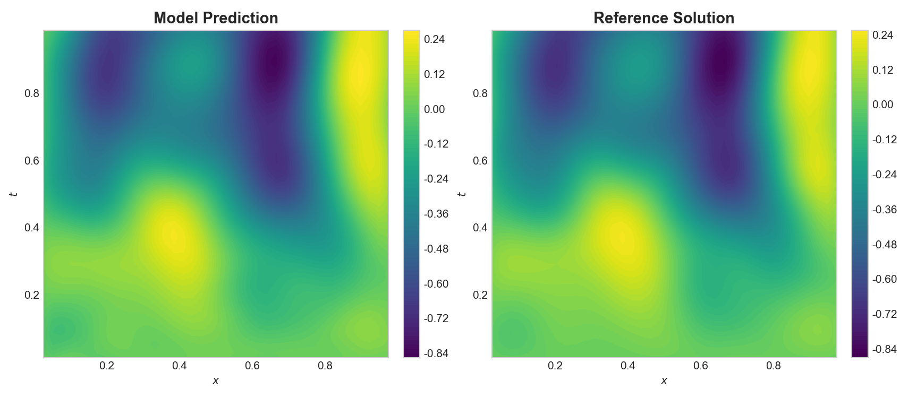
  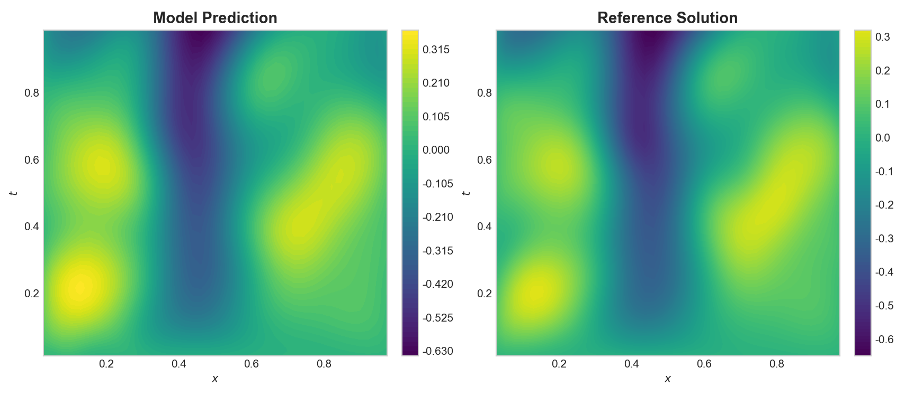
</p>

### Example 4

<p align="center">
  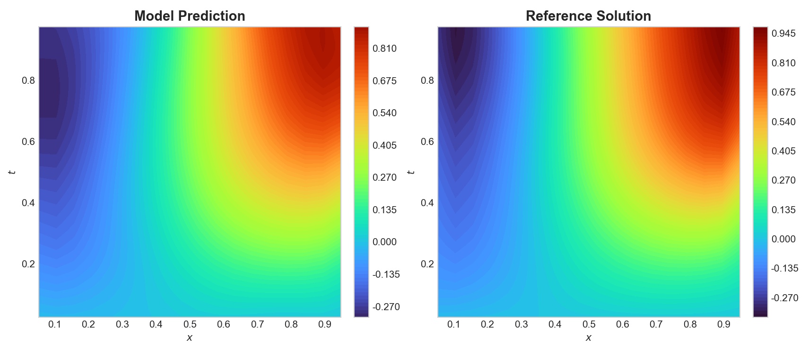
  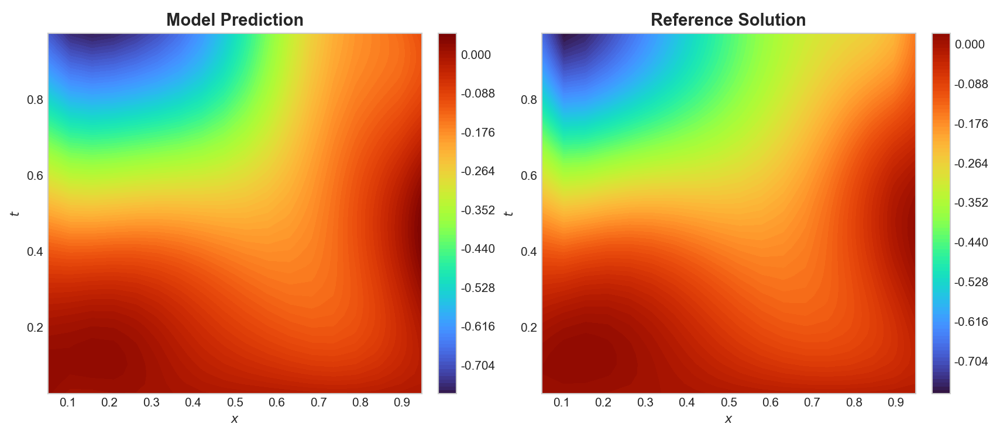
</p>

### Example 5

<p align="center">
  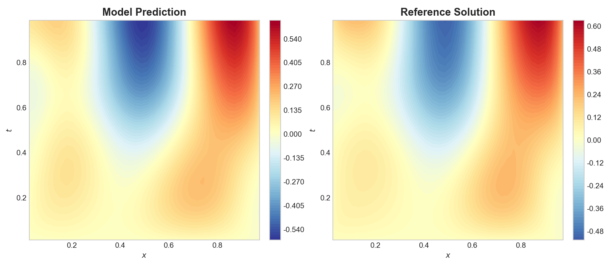
  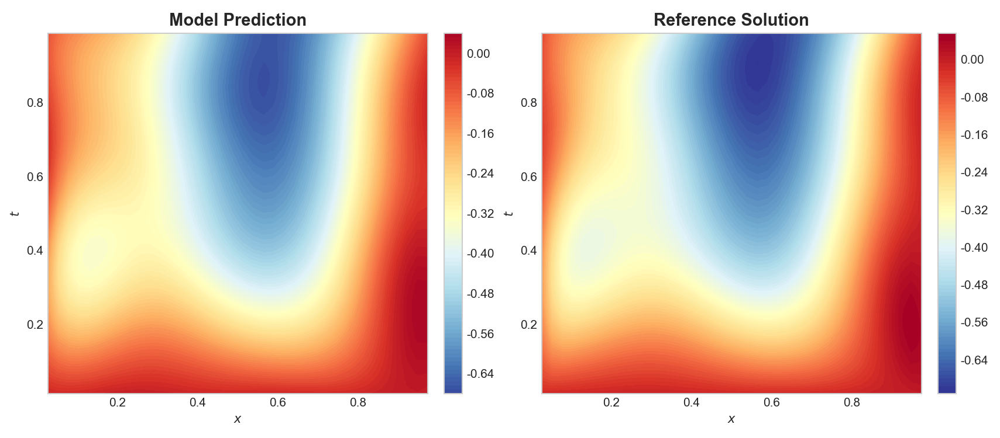
</p>

---

## Notes

- This repository is intended for research and experimental use.
- The code is organized as independent scripts for different benchmark settings.
- The current implementation emphasizes efficiency, simplicity, and reproducibility.
- The framework can be further adapted to other operator learning tasks by modifying the data generation and evaluation components.

---

## Citation

If you use this repository in your research, please cite the corresponding paper:

```bibtex
@article{alternatingrandonets,
  title   = {Alternating RandONets: Efficient Operator Learning via Random Projection and Alternating Optimization},
  author  = {Author(s)},
  journal = {arXiv / Journal},
  year    = {2026}
}
```

Please replace this entry with the final publication information.

---

## License

This project is released under the Apache-2.0 License.
